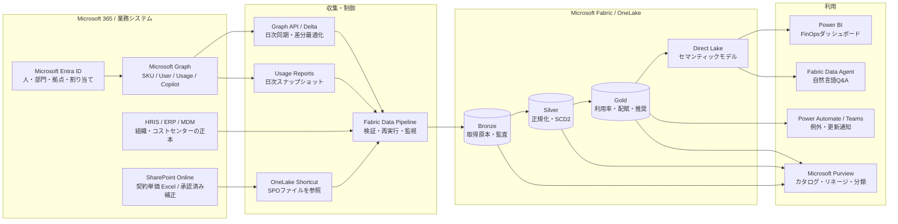

# Microsoft 365 License FinOps Reference Architecture

Microsoft 365 のライセンス在庫、ユーザー割り当て、サービス利用状況、契約単価を
Microsoft Fabric に統合し、Power BI と Fabric Data Agent から分析するための
リファレンス構成です。

この構成は次の問いに答えることを目的とします。

- 何を何ライセンス購入し、誰に割り当てているか
- ID保護、脅威対策、法務・監査など、E5の高度機能が誰に有効か
- Exchange、Teams、OneDrive、SharePoint、Office アプリ、Copilot を利用しているか
- 部門、拠点、会社、コストセンター別にいくら負担しているか
- 未利用、低利用、重複割り当て、ダウングレード候補はどこか
- 契約更新時に何ライセンス必要か

> [!IMPORTANT]
> Microsoft Graph のライセンス API は契約単価を返しません。また、Microsoft 365
> Usage Reports はリアルタイムの操作ログではありません。本構成では、データごとに
> 異なる更新特性を明示して、誤った「リアルタイム」表現を避けます。

## 推奨アーキテクチャ

## データの更新特性

| データ | 推奨取得方式 | 目標更新 | 実際の鮮度を決めるもの |
| --- | --- | --- | --- |
| ユーザー、部門、拠点、ライセンス割り当て | `users`または`users/delta` + 全件照合 | 日次 | Graph の結果整合性、HR/Entra 更新 |
| SKU購入数、消費数、サービスプラン | `subscribedSkus` | 日次 | Microsoft 365 ライセンス処理 |
| M365サービス利用実績 | Graph Usage Reports | 日次 | Microsoft側のレポート生成 |
| Copilot利用実績 | Copilot Usage Reports | 日次 | Microsoft側のレポート生成 |
| 契約単価 | SPO Excel + Shortcut + 検証Notebook | 15分以内、またはイベント駆動 | ファイル承認、Pipeline実行 |
| Power BI表示 | Direct Lake | Delta反映後、通常は数分以内 | モデルキャッシュ、容量状態 |

「リアルタイム」は単価マスタの承認反映に限定し、ライセンスと組織属性は日次、
Usage ReportsはMicrosoft側の更新周期に従います。レポートには必ず
`source_refresh_date` と `ingested_at_utc` を表示します。

## ドキュメント

- [詳細アーキテクチャ](docs/architecture.md)
- [Microsoft Graph / API取得範囲](docs/api-capabilities.md)
- [単価マスタとSPO Shortcut](docs/price-master.md)
- [人・部門・拠点・コストセンターの管理](docs/master-data.md)
- [運用、監視、セキュリティ](docs/operations.md)
- [デモ環境への反映](docs/demo-implementation.md)
- [お客様説明用トークトラック](docs/customer-talk-track.md)

## 設計上の結論

1. **Graphを価格マスタとして扱わない**: Graphは数量と権利を返しますが、契約単価は返しません。
2. **ShortcutとDeltaテーブルを分ける**: Shortcutは最新版ファイルへの参照、Notebookは検証・履歴化・分析用Deltaへの変換を担当します。
3. **Entraを人事マスタにしない**: HRISを正本とし、Entraは現在値の配布先、Fabricは分析履歴を保持します。
4. **Usageをリアルタイムと呼ばない**: Usage Reportsの`reportRefreshDate`を鮮度指標として扱います。
5. **推奨は根拠付き候補にする**: E5→E3などの判断は、利用実績だけでなくサービス有効化、ポリシー対象、役割、例外を併記します。

## 公式リファレンス

- [List subscribedSkus](https://learn.microsoft.com/graph/api/subscribedsku-list)
- [Get incremental changes for users](https://learn.microsoft.com/graph/delta-query-users)
- [Microsoft 365 usage reports overview](https://learn.microsoft.com/graph/api/resources/report)
- [OneLake shortcuts](https://learn.microsoft.com/fabric/onelake/onelake-shortcuts)
- [Create a OneDrive or SharePoint shortcut](https://learn.microsoft.com/fabric/onelake/create-onedrive-sharepoint-shortcut)
- [Direct Lake overview](https://learn.microsoft.com/fabric/fundamentals/direct-lake-overview)
