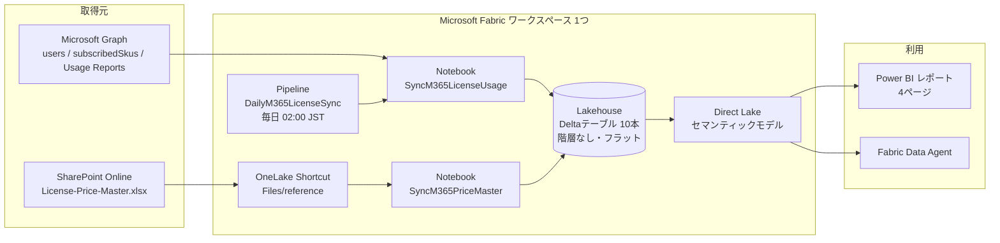

# Microsoft 365 License FinOps Reference Architecture

Microsoft 365 のライセンス在庫、ユーザー割り当て、サービス利用状況、契約単価を
Microsoft Fabric に統合し、Power BI と Fabric Data Agent から分析するための
リファレンス構成です。

この構成は次の問いに答えることを目的とします。

- 何を何ライセンス購入し、誰に割り当てているか
- ID保護、脅威対策、法務・監査など、E5の高度機能が誰に有効か
- Exchange、Teams、OneDrive、SharePoint、Office アプリ、Copilot を利用しているか
- 部門、拠点、会社、コストセンター別にいくら負担しているか
- 未利用、低利用のライセンスはどれくらいあるか
- 契約更新時に何ライセンス必要か

> [!IMPORTANT]
> Microsoft Graph のライセンス API は契約単価を返しません。また、Microsoft 365
> Usage Reports はリアルタイムの操作ログではありません。本構成では、データごとに
> 異なる更新特性を明示して、誤った「リアルタイム」表現を避けます。

## 現在の構成

実際に動いているのは次の構成です。Notebook 1本が Microsoft Graph を叩き、
Lakehouse へ日次スナップショットを書き、Direct Lake モデル経由で Power BI が読みます。
中間レイヤーも外部システム連携もありません。

### 作ったもの

| 種別 | 名前 | 役割 |
| --- | --- | --- |
| Lakehouse | `M365LicenseFinOps` | Deltaテーブル10本 |
| Notebook | `SyncM365LicenseUsage` | Graph取得と全テーブル書き込み |
| Notebook | `SyncM365PriceMaster` | SPOのExcelを検証して単価へ反映 |
| Pipeline | `DailyM365LicenseSync` | Notebookを日次実行 |
| Semantic model | `M365 License FinOps Model` | Direct Lake |
| Report | `M365 License FinOps Report` | 4ページ / 34ビジュアル |
| Data Agent | `M365LicenseFinOpsAgent` | 自然言語Q&A |

Fabric 容量は F8 (Japan East) です。Graph のアプリケーション権限は
`User.Read.All`、`Organization.Read.All`、`Reports.Read.All` の3つで足ります。

### Lakehouseのテーブル

Bronze/Silver/Gold のような層は作らず、10本のDeltaテーブルをフラットに並べています。

| テーブル | 内容 |
| --- | --- |
| `dim_user` | ユーザー、部門、拠点、役職、アカウント状態 |
| `dim_sku` | SKUコード、購入数、消費数 |
| `dim_sku_price` | SKU別の単価 |
| `dim_service_plan` | 内部プランと日本語の業務機能名・カテゴリ |
| `bridge_sku_service_plan` | SKUとサービスプランの対応 |
| `fact_license_assignment` | ユーザー×SKUの割り当て |
| `fact_service_entitlement` | ユーザー×サービスプランの有効/無効 |
| `fact_license_utilization` | 利用状態、最終利用日、非アクティブ日数 |
| `fact_m365_usage` | Exchange/OneDrive/SharePoint/Teamsの最終利用日 |
| `fact_copilot_usage` | Copilotの最終利用日、プロンプト数、利用日数 |

全テーブルが `snapshot_date` 列を持ち、同じ日付の行を削除してから追記します。
過去日のスナップショットはそのまま残るため、日単位の推移を追えます。

## 最低限で始めるには

上記のうち、Notebook 1本と Lakehouse と Power BI だけあれば動きます。

1. Fabric ワークスペースと Lakehouse を作る
2. Entra ID にアプリ登録し、Graph のアプリケーション権限3つを付与する
3. Notebook に `SyncM365LicenseUsage` を貼り、実行する
4. Direct Lake でセマンティックモデルを作り、レポートを作る

単価が不要なら SharePoint と Shortcut と `SyncM365PriceMaster` は省略できます。
Notebook にはパブリック定価が定義済みで、Excel が無ければそのまま使われます。
Pipeline も後回しにして、まず手動実行で構いません。

## データの更新特性

| データ | 現在の取得方式 | 更新 | 実際の鮮度を決めるもの |
| --- | --- | --- | --- |
| ユーザー、部門、拠点、ライセンス割り当て | `/users` 全件取得 | 日次 | Graph の結果整合性、Entra 更新 |
| SKU購入数、消費数、サービスプラン | `/subscribedSkus` | 日次 | Microsoft 365 ライセンス処理 |
| M365サービス利用実績 | `getOffice365ActiveUserDetail` | 日次 | Microsoft側のレポート生成 |
| Copilot利用実績 | `getMicrosoft365CopilotUsageUserDetail` | 日次 | Microsoft側のレポート生成 |
| 契約単価 | SPO Excel + Shortcut + 検証Notebook | 承認後に手動実行 | ファイル承認、Notebook実行 |
| Power BI表示 | Direct Lake | Delta反映後、通常は数分以内 | モデルキャッシュ、容量状態 |

ライセンスと組織属性は日次、Usage ReportsはMicrosoft側の更新周期に従います。
`/users/delta` は使わず全件取得しています。数千ユーザー規模までは全件で十分です。

## ドキュメント

- [詳細アーキテクチャ](docs/architecture.md) — 取得API、書き込み方式、テーブル、制約
- [Microsoft Graph / API取得範囲](docs/api-capabilities.md)
- [単価マスタとSPO Shortcut](docs/price-master.md)
- [人・部門・拠点・コストセンターの管理](docs/master-data.md)
- [運用、監視、セキュリティ](docs/operations.md)
- [デモ環境への反映](docs/demo-implementation.md)
- [お客様説明用トークトラック](docs/customer-talk-track.md)

## 設計上の結論

1. **Graphを価格マスタとして扱わない**: Graphは数量と権利を返しますが、契約単価は返しません。
2. **指標はテーブルではなくメジャーで持つ**: 集計テーブルを作らないぶん構成が減り、定義変更もモデル側だけで済みます。
3. **Usageをリアルタイムと呼ばない**: Usage Reportsの`reportRefreshDate`を鮮度指標として扱います。
4. **サービスの有効化と利用実績を分ける**: 機能が有効なことと、実際に使っていることは別の列で表示します。
5. **未設定を推測で埋めない**: 部門や拠点が空なら `Unassigned` として表示し、未整備の量が見えるようにします。

## 公式リファレンス

- [List subscribedSkus](https://learn.microsoft.com/graph/api/subscribedsku-list)
- [Get incremental changes for users](https://learn.microsoft.com/graph/delta-query-users)
- [Microsoft 365 usage reports overview](https://learn.microsoft.com/graph/api/resources/report)
- [OneLake shortcuts](https://learn.microsoft.com/fabric/onelake/onelake-shortcuts)
- [Create a OneDrive or SharePoint shortcut](https://learn.microsoft.com/fabric/onelake/create-onedrive-sharepoint-shortcut)
- [Direct Lake overview](https://learn.microsoft.com/fabric/fundamentals/direct-lake-overview)
