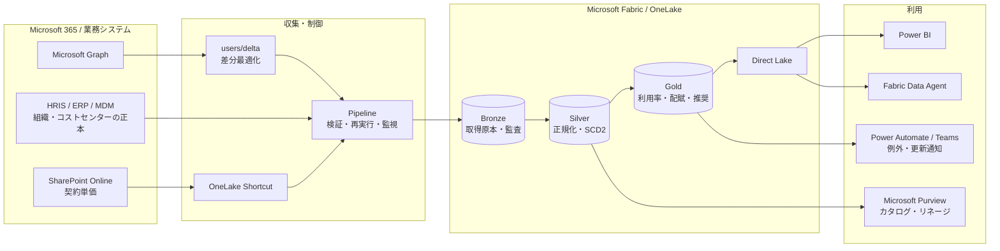

# 詳細アーキテクチャ

このドキュメントは、前半で**現在動いている構成**を、後半で**本番化するときに追加する要素**を
説明します。現行構成はあえて単純にしてあり、Notebook 1本で完結します。

## 1. 現行構成

### 全体の流れ

`SyncM365LicenseUsage` Notebook が毎日 02:00 (JST) に実行され、次を順に行います。

1. Microsoft Graph から4種類のデータを取得する
2. Python 側で結合・分類してテーブルごとの行を組み立てる
3. Lakehouse の Delta テーブルへスナップショットとして書く

中間ファイルも制御テーブルも作らず、1回の実行で取得から書き込みまで完結します。

### 取得している Graph API

| 呼び出し | 用途 |
| --- | --- |
| `GET /users?$select=...` | ユーザー、部門、拠点、役職、アカウント状態、割当SKU |
| `GET /subscribedSkus?$select=...` | SKU、購入数、消費数、含まれるサービスプラン |
| `GET /reports/getOffice365ActiveUserDetail(period='D30')` | Exchange/OneDrive/SharePoint/Teams の最終利用日 |
| `GET /copilot/reports/getMicrosoft365CopilotUsageUserDetail(period='D30',version='v2')` | Copilot の最終利用日、プロンプト数、利用日数 |

`/users/delta` は使っていません。全件取得のほうが状態管理が不要で、
数千ユーザー規模なら実行時間も問題になりません。

### 書き込み方式

全テーブルが `snapshot_date` 列を持ちます。書き込みは「同じ日付の行を消してから追記」です。

```python
DELETE FROM `{table}` WHERE snapshot_date = DATE '{today}'
frame.write.mode("append").format("delta").saveAsTable(table)
```

同日中に何度実行しても結果が変わらず、過去日のスナップショットは残ります。
SCD Type 2 のような有効期間管理は行っていません。「その日どうだったか」を
日付で引く方式です。

### テーブル一覧

階層は作らず、10本をフラットに並べています。

| テーブル | 種別 | 内容 |
| --- | --- | --- |
| `dim_user` | ディメンション | ユーザーの当日値 |
| `dim_sku` | ディメンション | SKUコード、購入数、消費数 |
| `dim_sku_price` | ディメンション | SKU別の単価と出典 |
| `dim_service_plan` | ディメンション | 内部プランと日本語の業務機能名・カテゴリ・E5判断区分 |
| `bridge_sku_service_plan` | ブリッジ | SKUとサービスプランの多対多 |
| `fact_license_assignment` | ファクト | ユーザー×SKU |
| `fact_service_entitlement` | ファクト | ユーザー×サービスプランの有効/無効 |
| `fact_license_utilization` | ファクト | 利用状態、最終利用日、非アクティブ日数 |
| `fact_m365_usage` | ファクト | サービス別の最終利用日 |
| `fact_copilot_usage` | ファクト | Copilotの利用実績 |

### 計算をどこで行っているか

利用率、月額コスト、削減可能額、E5機能の有効/無効判定は
**Delta テーブルではなくセマンティックモデルの DAX メジャー**で計算しています。
集計済みテーブルを作らないぶん構成が減り、指標の定義変更もモデル側だけで済みます。

Notebook 側で行っているのは、テーブルに保存しないと再現できない次の2つだけです。

- 利用状態の分類（`Active` / `LowUsage` / `Dormant` / `NeverUsed` / `DisabledAccount`）
- 内部サービスプランから日本語の業務機能への集約

### 利用状態の判定

`fact_license_utilization` の `utilization_status` は、SKUの種類に応じて
参照する最終利用日を切り替えてから、経過日数で分類します。

| SKU | 参照する最終利用日 |
| --- | --- |
| Copilot を含む | Copilot Usage Reports |
| Teams 単体（`NO_TEAMS` を含まない） | Teams の最終利用日 |
| その他 | Exchange/OneDrive/SharePoint/Teams のうち最も新しい日 |

分類は経過日数で `30日以内 = Active`、`89日以内 = LowUsage`、それ以上 = `Dormant`、
利用日なし = `NeverUsed`、無効アカウント = `DisabledAccount` です。

> [!NOTE]
> SKU名の部分一致には注意が必要です。`Microsoft_365_E5_(no_Teams)` は
> Teams が含まれない SKU にもかかわらず文字列に `TEAMS` を含むため、
> 単純な部分一致だと Teams の利用実績を参照して値が空になります。

### 単価の扱い

`dim_sku_price` は次の優先順で決まります。

1. SharePoint 上の `License-Price-Master.xlsx` の `Approved` 行
2. Notebook に定義されたパブリック定価（JP、年間契約、税抜）

Shortcut が無い、または Excel が読めない場合は 2 が使われるため、
**SharePoint を用意しなくても構成は動きます**。契約単価が必要になった時点で
Excel を置けば、そちらが優先されます。

## 2. 現行の割り切り

推奨構成との差分を明示します。デモや小規模導入では、これらは無くても成立します。

| 項目 | 推奨構成 | 現行構成 | 影響 |
| --- | --- | --- | --- |
| レイヤー | Bronze / Silver / Gold | フラット10テーブル | 再処理時に取得原本へ戻れない |
| 履歴 | SCD Type 2 | 日次スナップショット | 異動の前後関係を厳密に追えない |
| 差分取得 | `/users/delta` + deltaLink管理 | `/users` 全件 | ユーザー数が増えると実行時間が伸びる |
| 実行制御 | `control_ingestion_run` | なし | 件数・エラーの履歴が残らない |
| 集計テーブル | Gold ファクト | DAXメジャー | 大規模データで計算が重くなる |
| 組織マスタ | HRIS / ERP 連携 | Entra の値のみ | コストセンター配賦ができない |
| 通知 | Power Automate / Teams | なし | 異常に気づくのが遅れる |
| カタログ | Microsoft Purview | なし | 分類・リネージが管理されない |
| 単価承認 | イベント駆動 | 手動実行 | 反映漏れが起きうる |

「まず動かす」ことを優先するなら現行構成で十分です。ユーザー数が数万規模、
複数法人での配賦が必要、監査対応が必要、といった条件が加わった時点で
次章の要素を足します。

## 3. 本番化で追加する要素



### 3.1 設計原則

取得元と分析用データを分離します。Microsoft Graph、HRIS、SharePoint Online は
業務上の正本です。Fabric はそれらを置き換えるのではなく、取得時点の原本、
変更履歴、分析しやすい共通モデルを保持します。

### 3.2 データの速度を3レーンに分ける

#### Daily directory lane: 割り当て・組織属性

- `/users`を日次取得し、必要に応じて`/users/delta`で転送量を最適化
- `@odata.deltaLink`を制御テーブルに保存
- 定期的に全件スナップショットを取得し、削除や取りこぼしを照合

Graph deltaは日次同期の転送量を減らす最適化であり、リアルタイム要件には使いません。

#### Daily lane: 利用実績

- APIレスポンスの`reportRefreshDate`を保存
- 取得時刻ではなく、ソース側の更新日を鮮度判定に使用
- 180日を超える履歴はFabric側で日次スナップショットとして保持

#### Reference lane: 単価・組織補正

- OneLake Shortcutが同じファイルを参照し、コピーを作らない
- Notebookが列名、型、重複、有効期間を検証
- 合格した行だけをDeltaへMERGEし、変更前の価格は履歴として残す
- 不合格時は本番価格テーブルを更新せず、Teamsへ通知

### 3.3 Lakehouseのレイヤー

#### Bronze: 原本と監査

| テーブル/ファイル | 内容 |
| --- | --- |
| `bronze_graph_users` | Graph userレスポンス。取得日時とrequest IDを付与 |
| `bronze_graph_skus` | subscribedSkusの原本 |
| `bronze_m365_usage` | Usage Reports CSV原本 |
| `bronze_copilot_usage` | Copilot Usage Reports原本 |
| `control_ingestion_run` | run ID、開始/終了、件数、エラー、ソース更新日 |
| `control_graph_delta_token` | リソース別deltaLink |

Bronzeは再処理と監査のために保持し、Power BIから直接参照しません。

#### Silver: 共通マスタと履歴

現行の `dim_user` を `dim_user_current` と `dim_user_history` に分け、
部門・拠点・会社・コストセンターの SCD Type 2 履歴を持たせます。
`dim_organization`、`dim_location`、`dim_license_price_history` を追加します。

#### Gold: FinOps指標

現行では DAX メジャーで計算している指標を、事前集計テーブルにします。

| テーブル | 主な指標 |
| --- | --- |
| `fact_license_cost` | 月額コスト、部門/拠点/コストセンター配賦 |
| `fact_license_overlap` | 複数SKUが同じサービスプランを提供する重複 |
| `fact_rightsizing_candidate` | E5→E3、E3→E5、回収候補と根拠 |
| `fact_data_freshness` | ソース別の最終更新、遅延、SLA違反 |

## 4. E3/E5右サイジング

推奨判定は単純な最終利用日だけで行いません。現行のレポートでも
「要確認候補」までを示し、解約判断は人が行う前提にしています。

### E5→E3候補

- E5固有の能動サービス利用が一定期間ない
- E5固有サービスプランが無効、またはプロビジョニング対象外
- Teams Phone、Power BI Pro、PIM、Defender、Purview等の必要性が確認されていない
- 例外リスト、法務・監査ポリシー、特権ロール対象外
- E3との差額と変更影響を算出できる

### E3→E5候補

- E5相当のアドオンを複数個別購入している
- 特権ユーザーだがPIM/高度なID保護が必要
- Purview/Defenderポリシーの対象だが必要な権利が不足
- Teams Phoneや高度な分析など、明確な業務要件がある

### 表示ルール

- 「自動解約」ではなく「要確認候補」と表示
- Graphの内部プラン名は監査用に保持し、通常画面では日本語の業務機能へ集約
- 技術・付帯プランはE5/E3判断画面から除外
- サービスプランの有効化は設定シグナルであり、利用実績として扱わない
- 推定削減額と、判断に使えなかった情報を併記

## 5. Power BIとData Agent

- Direct LakeモデルはLakehouseのテーブルを直接参照
- 指標は DAX メジャーで定義し、テーブルには持たせない
- RLSが必要なら、部門責任者とコストセンター責任者のブリッジを別管理
- Data Agentには右サイジングを断定しない指示と、コストが推定か契約単価かを明示する指示を設定
