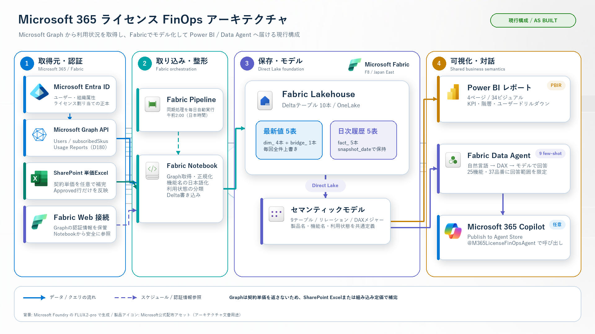
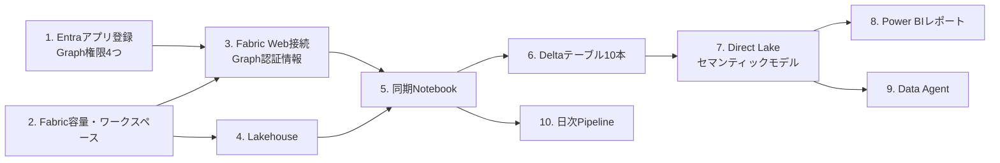
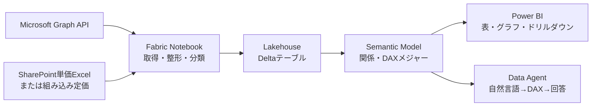

# 詳細アーキテクチャ

現在動いている構成を説明します。Notebook 1本で取得から書き込みまで完結します。

## 1. 現行構成

### 全体の流れ



このPNGは説明・共有用です。背景は Microsoft Foundry の `FLUX.2-pro` で生成し、
製品名、日本語ラベル、接続線、Microsoft公式アイコンは後から正確に合成しています。
[生成元とアイコン出典](images/README.md)に利用した公式配布元を記録しています。

`SyncM365LicenseUsage` Notebook が毎日 02:00 (JST) に実行され、次を順に行います。

1. Microsoft Graph から4種類のデータを取得する
2. Python 側で結合・分類してテーブルごとの行を組み立てる
3. Lakehouseへ最新マスタ5表と日次スナップショット5表を書き込む

中間ファイルも制御テーブルも作らず、1回の実行で取得から書き込みまで完結します。

### 何をどの順序で作るか

構築は次の依存関係に沿って進めます。後段のアイテムは前段のIDやデータを参照します。



| 順序 | 作るもの | 入力 | 出力・次で使うもの |
| --- | --- | --- | --- |
| 1 | Entraアプリ登録 | なし | テナントID、クライアントID、Graph権限 |
| 2 | Fabric容量・ワークスペース | Fabric容量 | ワークスペースID |
| 3 | Fabric Web接続 | GraphアプリのIDとシークレット | Notebookから参照する接続ID |
| 4 | Lakehouse | ワークスペース | Lakehouse ID、OneLake保存先 |
| 5 | `SyncM365LicenseUsage` | Graph認証情報、Lakehouse | Graphから取得したデータ |
| 6 | Deltaテーブル10本 | Notebookの処理結果 | Direct Lakeで参照するテーブル |
| 7 | セマンティックモデル | Lakehouseテーブル | リレーション、DAXメジャー |
| 8 | Power BIレポート | セマンティックモデル | 4ページの可視化 |
| 9 | Data Agent | セマンティックモデル | 自然言語でのデータ照会 |
| 10 | `DailyM365LicenseSync` | 同期Notebook | 毎日02:00の自動更新 |

実際の配置は [構築手順](setup.md) の
`tools/deploy_fabric_items.ps1` が手順3、5、7、8、9、10を自動化します。

### データが回答になるまで



- NotebookはAPIレスポンスを分析しやすい粒度へ変換します。
- Lakehouseは日付付きのデータをDelta形式で保持します。
- セマンティックモデルはテーブル同士を結び、指標の計算式を定義します。
- Power BIとData Agentは同じセマンティックモデルを使うため、指標定義が一致します。

### サービスごとの役割分担

| サービス・アイテム | 担当すること | 担当しないこと |
| --- | --- | --- |
| Microsoft Entra ID | ユーザー、組織属性、ライセンス割り当ての正本 | 利用実績や契約単価の保持 |
| Microsoft Graph | Microsoft 365データをAPIで返す | データの長期保存、契約単価の提供 |
| Fabric Web接続 | Graphの認証情報を暗号化して保管し、短期AccessTokenを発行 | データ変換や分析 |
| Fabric Notebook | API取得、正規化、分類、Delta書き込み | レポート表示、ユーザー対話 |
| Fabric Lakehouse | 最新マスタと日次ファクトをDelta形式で保持 | 指標の意味や画面レイアウトの定義 |
| Fabric Pipeline | Notebookを毎日実行 | データの中身の計算 |
| セマンティックモデル | リレーション、表示名、DAXメジャーを定義 | Graph APIの呼び出し |
| Power BIレポート | KPI、表、グラフ、フィルター、ドリルダウンを表示 | データの取得・保存 |
| Fabric Data Agent | 自然言語をDAXへ変換し、モデルのデータで回答 | データ更新、ライセンス変更 |
| SharePoint + Shortcut | 契約単価Excelを保管し、Lakehouseから参照 | Excelを自動で分析テーブルへ変換 |

NotebookはFabric Web接続の専用IDを使って短期AccessTokenを取得します。
クライアントシークレットはNotebookやGitへ保存されず、実行時にもNotebookへ渡りません。

### 取得している Graph API

| 呼び出し | 用途 |
| --- | --- |
| `GET /users?$select=...` | ユーザー、部門、拠点、役職、アカウント状態、割当SKU |
| `GET /subscribedSkus?$select=...` | SKU、購入数、消費数、含まれるサービスプラン |
| `GET /reports/getOffice365ActiveUserDetail(period='D180')` | Exchange/OneDrive/SharePoint/Teams の最終利用日 |
| `GET /copilot/reports/getMicrosoft365CopilotUsageUserDetail(period='D180',version='v2')` | Copilot の最終利用日、プロンプト数、利用日数 |

`/users/delta` は使っていません。全件取得のほうが状態管理が不要で、
数千ユーザー規模なら実行時間も問題になりません。

### 書き込み方式

10テーブルは、最新状態を持つテーブルと日次履歴を持つテーブルに分かれます。

| 書き込み方式 | テーブル | 保持内容 |
| --- | --- | --- |
| 全件上書き | `dim_user`、`dim_sku`、`dim_service_plan`、`bridge_sku_service_plan`、`dim_sku_price` | 最新のマスタ・対応・単価 |
| 同日削除後に追記 | `fact_license_assignment`、`fact_service_entitlement`、`fact_m365_usage`、`fact_copilot_usage`、`fact_license_utilization` | 日次スナップショット |

日次ファクトの書き込みは「同じ日付の行を消してから追記」です。

```python
DELETE FROM `{table}` WHERE snapshot_date = DATE '{today}'
frame.write.mode("append").format("delta").saveAsTable(table)
```

同日中に何度実行しても重複せず、ファクトの過去日スナップショットは残ります。
ディメンションとブリッジは毎回上書きされるため、過去の属性値は残りません。
SCD Type 2 のような有効期間管理は行っていません。

### テーブル一覧

階層は作らず、10本をフラットに並べています。

| テーブル | 種別 | 内容 |
| --- | --- | --- |
| `dim_user` | ディメンション | ユーザーの当日値 |
| `dim_sku` | ディメンション | SKUコード、購入数、消費数 |
| `dim_sku_price` | ディメンション | SKU別の単価と出典 |
| `dim_service_plan` | ディメンション | 内部プランと日本語の業務機能名・カテゴリ・E5判断区分 |
| `bridge_sku_service_plan` | ブリッジ | SKUとサービスプランの多対多 |
| `fact_license_assignment` | ファクト | ユーザー×SKU |
| `fact_service_entitlement` | ファクト | ユーザー×サービスプランの有効/無効 |
| `fact_license_utilization` | ファクト | 利用状態、最終利用日、非アクティブ日数 |
| `fact_m365_usage` | ファクト | サービス別の最終利用日 |
| `fact_copilot_usage` | ファクト | Copilotの利用実績 |

### 計算をどこで行っているか

利用率、月額コスト、削減可能額、E5機能の有効/無効判定は
**Delta テーブルではなくセマンティックモデルの DAX メジャー**で計算しています。
集計済みテーブルを作らないぶん構成が減り、指標の定義変更もモデル側だけで済みます。

Notebook 側で行っているのは、テーブルに保存しないと再現できない次の2つだけです。

- 利用状態の分類（`Active` / `LowUsage` / `Dormant` / `NeverUsed` / `DisabledAccount`）
- 内部サービスプランから日本語の業務機能への集約

### 利用状態の判定

`fact_license_utilization` の `utilization_status` は、SKUの種類に応じて
参照する最終利用日を切り替えてから、経過日数で分類します。

| SKU | 参照する最終利用日 |
| --- | --- |
| Copilot を含む | Copilot Usage Reports |
| Teams 単体（`NO_TEAMS` を含まない） | Teams の最終利用日 |
| その他 | Exchange/OneDrive/SharePoint/Teams のうち最も新しい日 |

分類は経過日数で `30日以内 = Active`、`89日以内 = LowUsage`、それ以上 = `Dormant`、
利用日なし = `NeverUsed`、無効アカウント = `DisabledAccount` です。

> [!NOTE]
> SKU名の部分一致には注意が必要です。`Microsoft_365_E5_(no_Teams)` は
> Teams が含まれない SKU にもかかわらず文字列に `TEAMS` を含むため、
> 単純な部分一致だと Teams の利用実績を参照して値が空になります。

## 2. 単価とのマッピング

Graph は契約単価を返さないため、SKU コードをキーにして外部の単価を結合します。

### 結合キー

| テーブル | キー | 備考 |
| --- | --- | --- |
| `dim_sku` | `sku_id` / `sku_part_number` | Graph の `subscribedSkus` から取得 |
| `dim_sku_price` | `sku_id` | `sku_part_number` を大文字化して単価表と突合 |

Excel 側は `sku_part_number` で書くため、Notebook が大文字化して比較します。
`Microsoft_365_E5_(no_Teams)` は `MICROSOFT_365_E5_(NO_TEAMS)` として扱われます。

### 単価の決まり方

1. SharePoint 上の `License-Price-Master.xlsx` の `Approved` 行
2. Notebook に定義されたパブリック定価（JP、年間契約、税抜）

Shortcut が無い、または Excel が読めない場合は 2 が使われるため、
**SharePoint を用意しなくても構成は動きます**。

Notebook に定義されている定価は次のとおりです。

| SKU コード | 表示名 | 月額 (JPY) |
| --- | --- | --- |
| `MICROSOFT_365_E5_(NO_TEAMS)` | Microsoft 365 E5 (no Teams) | 7,713 |
| `MICROSOFT_365_COPILOT` | Microsoft 365 Copilot | 4,497 |
| `M365_TEAMS_PREMIUM` | Microsoft Teams Premium (add-on) | 1,499 |
| `MICROSOFT_TEAMS_ENTERPRISE_NEW` | Microsoft Teams Enterprise (base license) | 1,281 |

`FLOW_FREE` は無料 SKU のため単価を持ちません。単価が見つからない SKU は
`Contract price required` として記録され、コスト計算から外れます。

月額コストは `割り当て数 × 単価` を DAX メジャーで計算します。
`dim_sku_price` は有効期間を持たず、当日の単価だけを保持します。

## 3. 製品とサービスプランのマッピング

Graph は SKU に含まれるサービスプランを内部コードで返します。
そのままでは読めないため、2段階で変換しています。

```text
subscribedSkus[].servicePlans[]        Graph の内部コード (124件)
        ↓ bridge_sku_service_plan      SKU とプランの対応
        ↓ dim_service_plan             日本語の業務機能へ集約 (37件 → 25機能)
Power BI                               機能名 ＋ 一般製品名で表示
```

### テーブルの役割

| テーブル | 内容 |
| --- | --- |
| `bridge_sku_service_plan` | どの SKU にどのサービスプランが含まれるか |
| `dim_service_plan` | 内部コード、日本語の機能名、カテゴリ、確認ポイント |
| `fact_service_entitlement` | ユーザー×サービスプランの有効/無効 |

### 内部コードから機能名への変換

`dim_service_plan` には Graph が返した 124 件すべてが入りますが、
日本語名を付けているのは E5 の判断に関係する 37 件です。
これを 25 の業務機能へ集約します。`レポート表示対象` 列で絞り込みます。

機能名は `用途（一般製品名）` の形にしています。

| カテゴリ | 機能名の例 |
| --- | --- |
| ID管理 | 高度なID保護・特権管理（Microsoft Entra ID P2） |
| セキュリティ | 端末の脅威検知・対応（Microsoft Defender for Endpoint Plan 2） |
| 情報保護 | 機密ラベル・自動分類（Microsoft Purview Information Protection） |
| 法務・監査 | 法務調査・電子情報開示（Microsoft Purview eDiscovery Premium） |
| 通話・会議 | Teams電話・クラウドPBX（Microsoft Teams Phone Standard） |
| 分析 | Power BIの共有・共同作業（Power BI Pro） |

### 1つの機能に複数の品番が対応する

同じ業務機能が複数の内部コードで構成されることがあります。
37 件を 25 機能へ集約しているのはこのためです。

| 機能名 | 内部コード |
| --- | --- |
| 機密ラベル・自動分類 | 4件 |
| 働き方の高度分析 | 3件 |
| 法務調査・電子情報開示 | 3件 |
| クラウドアプリの監視・制御 | `ADALLOM_S_O365` / `ADALLOM_S_STANDALONE` |
| Microsoftのデータアクセス承認 | `CustomerLockboxA_Enterprise` / `LOCKBOX_ENTERPRISE` |

Power BI ではマトリックスの階層にしており、機能名を展開すると
管理センターで使われる品番が確認できます。

### 有効/無効の判定

`fact_service_entitlement` の `is_enabled` は、Graph の
`assignedLicenses[].disabledPlans` にそのプランが**含まれていないか**で決まります。
管理センターの「ライセンスとアプリ」のチェック状態と一致します。

1つの機能を構成する内部コードが複数ある場合、Power BI 側では
すべて有効なら `有効`、1つでも無効なら `無効` と表示します。

これはライセンス設定であり、実際に使ったかどうかではありません。
利用実績は `fact_license_utilization` の `利用状態` で別に見ます。

## 4. 現行構成の制約

単純にしたぶん、次のことはできません。前提として押さえておく項目です。

| 項目 | 現状 | できないこと |
| --- | --- | --- |
| レイヤー | フラット10テーブル | 取得原本へ戻っての再処理 |
| 履歴 | 日次スナップショット | 異動の前後関係を有効期間で厳密に追うこと |
| 取得 | `/users` 全件 | ユーザー数が数万規模になったときの実行時間短縮 |
| 実行制御 | なし | 件数・エラーの履歴を残すこと |
| 集計 | DAXメジャー | 大規模データでの計算負荷の分散 |
| 単価 | 当日の値のみ | 過去の単価での再計算 |
| 組織マスタ | Entra の値のみ | コストセンター単位の配賦 |
| 通知 | なし | 異常の自動検知 |
| 単価承認 | 手動実行 | 承認と同時の自動反映 |
