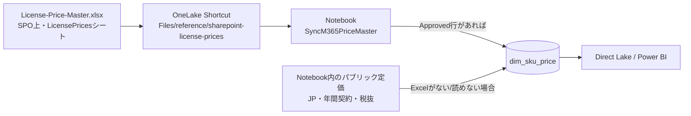
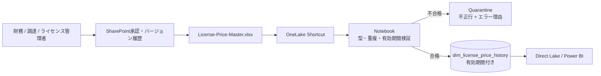

# 単価マスタとSPO Shortcut

## 現在の構成

単価は2段構えで決まります。**SharePoint を用意しなくても動きます**。

| 優先順 | ソース | 条件 |
| --- | --- | --- |
| 1 | SPO の Excel | Shortcut があり、`status = Approved` の行がある |
| 2 | Notebook 内のパブリック定価 | 上記以外 |

まずは定価で動かし、契約単価が必要になった段階で SharePoint を追加する、
という進め方ができます。現行の `dim_sku_price` は有効期間を持たず、
当日の単価だけを保持します。

`FLOW_FREE` のような無料 SKU は価格マスタに含めず、契約コストの対象外として扱います。

## 本番化する場合の構成

契約改定の履歴を残し、不正な行を本番へ反映させないなら、検証と隣接を追加します。

## Shortcutで自動化できる範囲

できること:

- SPO/OneDrive上の同じファイルをOneLake Filesから参照する
- Fabric側にコピーを作らず、最新版のファイルへアクセスする
- ファイル差し替え後もShortcutを作り直さない

できないこと:

- Excelを自動的にDeltaテーブルへ変換する
- Excelの列型、重複、有効期間を自動検証する
- 誤った価格を本番テーブルへ反映しないための承認制御
- Power BIの分析モデルを自動的に履歴化する

そのため、Shortcutの後にNotebookまたはDataflow Gen2を置きます。本構成では、
複雑な有効期間検証とMERGEが必要なためNotebookを推奨します。

## Excelテーブル仕様

シート名: `LicensePrices`

Excel Table名: `LicensePrices`

| 列 | 必須 | 例 | 説明 |
| --- | --- | --- | --- |
| `sku_part_number` | Yes | `MICROSOFT_365_COPILOT` | Graphと結合するSKUコード |
| `license_name` | Yes | `Microsoft 365 Copilot` | 表示名 |
| `currency` | Yes | `JPY` | ISO通貨コード |
| `unit_price_monthly` | Yes | `4497` | 1ユーザー当たり税抜月額 |
| `price_type` | Yes | `Contract` | `Contract` / `PublicList` / `Estimate` |
| `effective_from` | Yes | `2026-08-01` | 適用開始日 |
| `effective_to` | No | 空白 | 適用終了日。空白は現行 |
| `billing_term` | Yes | `AnnualCommitMonthlyPay` | 契約条件 |
| `agreement_id` | No | `EA-xxxx` | 契約参照番号。秘密情報は入れない |
| `source_document` | Yes | `FY27 M365 price sheet` | 根拠資料 |
| `owner_upn` | Yes | `license-owner@contoso.com` | データ責任者 |
| `approved_by` | Yes | `finance-approver@contoso.com` | 承認者 |
| `approved_at_utc` | Yes | `2026-08-01T01:00:00Z` | 承認時刻 |
| `status` | Yes | `Approved` | `Draft`は本番反映しない |
| `notes` | No | 任意 | 例外や前提 |

## 検証ルール

1. 必須列が存在し、Excel Tableとして定義されている
2. `sku_part_number + currency + effective_from`が一意
3. Approved行の単価は0より大きい
4. 同一SKU/通貨で有効期間が重複しない
5. `approved_by`と`approved_at_utc`が設定されている
6. GraphのSKUに存在しない行は警告。比較用E3などは`reference_only=true`で許可
7. エラー時は既存の本番価格を維持し、全置換しない

## 起動方式

### 現行: 手動実行

SPO の Excel を更新したら `SyncM365PriceMaster` を手動で実行します。
日次 Pipeline でも単価は再確認されます。価格改定が年数回ならこれで十分です。

### 本番化: イベント + 定期照合

- SPOファイル更新をPower Automateで検知
- 承認済みの場合だけFabric Pipelineのオンデマンド実行APIを呼ぶ
- 15分スケジュールでも照合し、イベント取りこぼしを回復
- 夜間ジョブでGraph SKUと価格未設定SKUを照合

## 本番でExcelを採用する判断

Excel + SPOは、価格行数が少なく、更新者が限定され、月次以下の変更頻度であれば
実用的です。複数承認、行レベル権限、多数通貨、頻繁な契約改定が必要なら、
SharePoint List、Dataverse、財務MDM、Azure SQLへ移行します。

## 公式リファレンス

- [Create a OneDrive or SharePoint shortcut](https://learn.microsoft.com/fabric/onelake/create-onedrive-sharepoint-shortcut)
- [OneLake shortcuts](https://learn.microsoft.com/fabric/onelake/onelake-shortcuts)
- [OneLake shortcuts REST API](https://learn.microsoft.com/rest/api/fabric/core/onelake-shortcuts)
